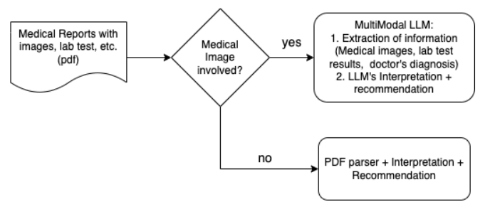

# MultiModal LLM Interpretor for Medical Reports and Images 
* This is a proof-of-concept (POC) application to assist users with non-medical background in understanding medical reports and medical images, leveraging on the multimodal capability of Large Language Models (LLM).

## Solution Architecture

<figure>
    
    <figcaption>This app takes in pdf of medical reports including medical images, checks if it is an image problem or merely a text problem. If it is an image problem, it'll convert pdf to one image per page, employs a multimodal LLM to 'read' the contents and provide interpretations and recommendations. If it is a mere text problem, it'll use a PDF parser to parse out text before using LLM to provide interpretations and recommendations</figcaption>
</figure>
